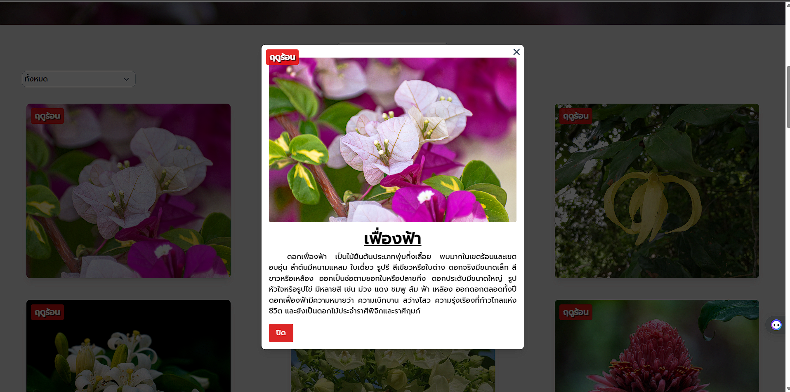
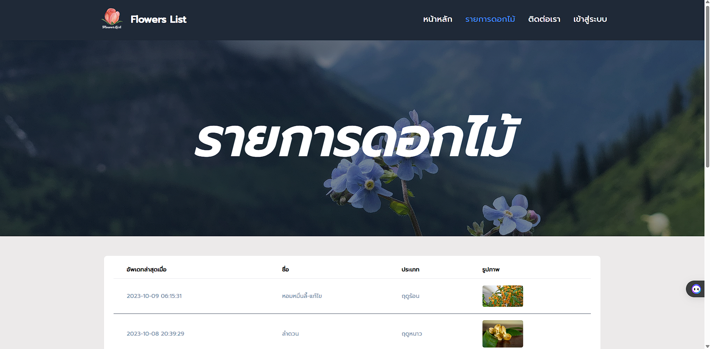
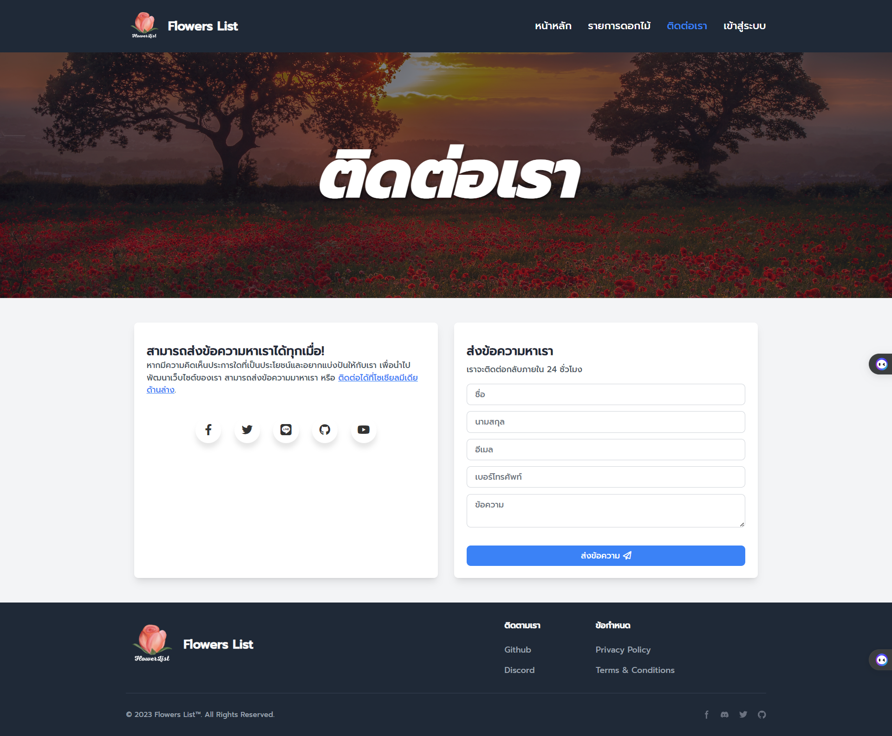
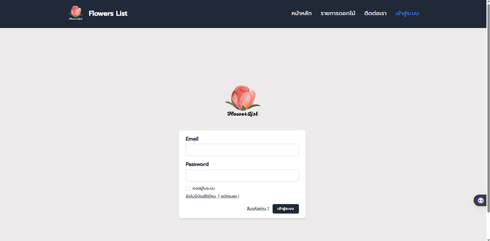
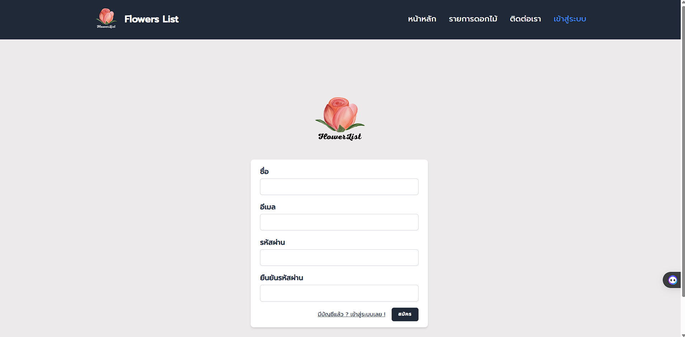
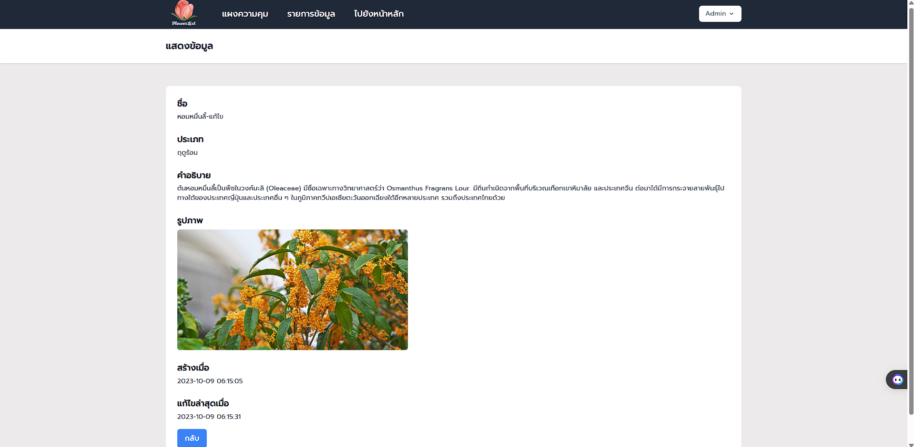
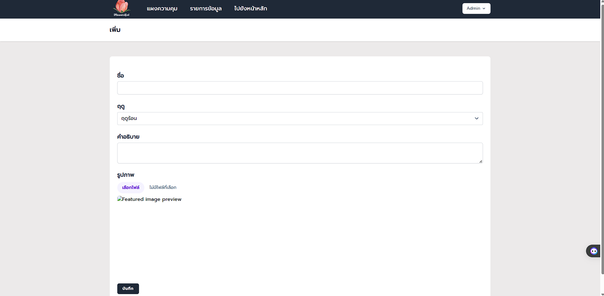
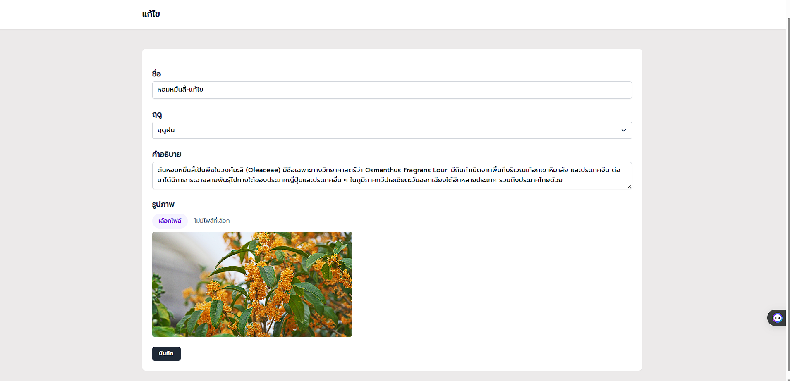

# Laravel-Flower-Project
## CRUD-Laravel
## #เว็บไซต์ให้ความรู้เรื่องดอกไม้ 3 ฤดู 

### <ins> หน้าหลัก </ins> 

### <ins> กดเข้าไปแต่ละเนื้อหา </ins> 

### <ins> หน้าดูรายการแบบรวม </ins> 

### <ins> หน้าติดต่อ </ins> 

### <ins> หน้าเข้าสู่ระบบ </ins> 

### <ins> หน้าสมัครสมาชิก </ins> 

### <ins> หน้าดูข้อมูล Back-End </ins> 

### <ins> หน้าเพิ่มข้อมูล Back-End </ins> 

### <ins> หน้าแก้ไขข้อมูล Back-End </ins> 

